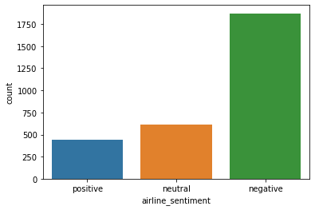
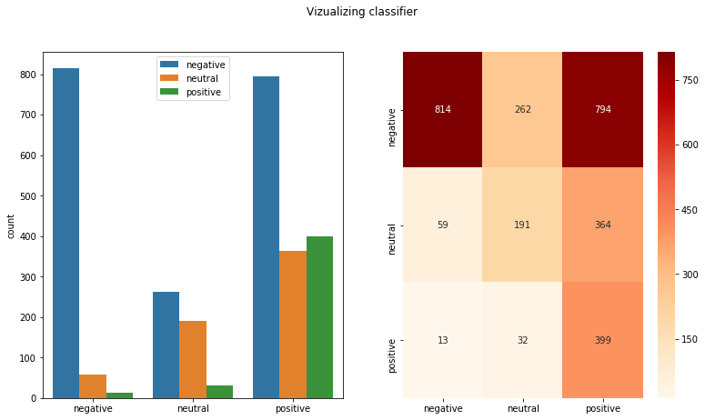
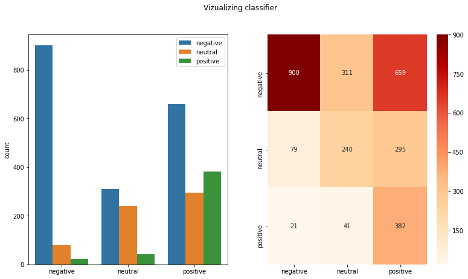
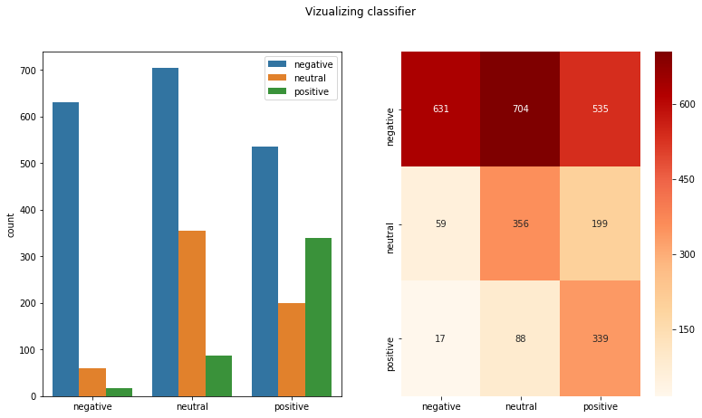
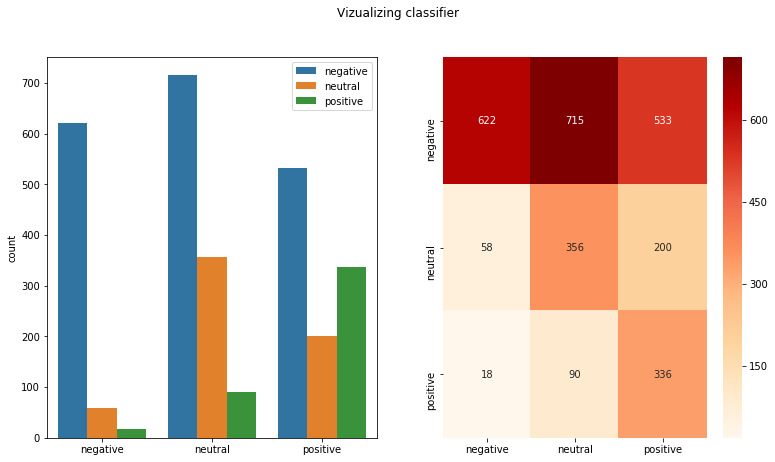
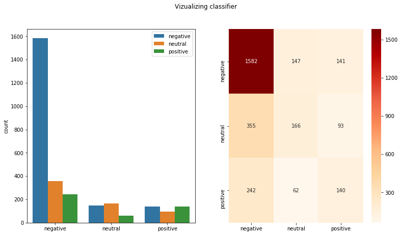
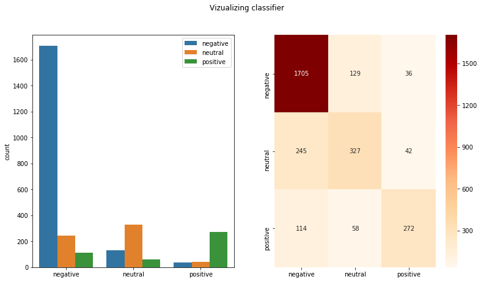

# Comparison of various sentiment analysis frameworks

I explore the performance of **VADER** and **TextBlob** against my **TweetProcessor** framework. The sentiment score of is calculated using raw or preprocessed tweets from the [Airline Sentiment](https://www.kaggle.com/crowdflower/twitter-airline-sentiment/) dataset of kaggle. The tokenization is applied through the `tweet_preprocessing` function of **TweetProcessor**. Additionally the **TextBlob Naive Bayes** classifier is tested against my **one-vs-rest Bernoulli Naive Bayes** classifier.

The evaluation is concluded by visualizing the confusion matrix of the prediction as well as the prediction distribution and presenting the classicification metrics (accuracy, precision, recall, f1-score)

1. VADER sentiment with raw tweets
2. VADER sentiment with tokenized tweets
3. TextBlob sentiment with raw tweets
4. TextBlob sentiment with tokenized tweets
5. TextBlob Naive Bayes classifier
6. TweetProcessor one-vs-rest Bernoulli Naive Bayes classifier


```python
import numpy as np
import pandas as pd
import seaborn as sns
import matplotlib.pyplot as plt


from vaderSentiment.vaderSentiment import SentimentIntensityAnalyzer
from textblob import TextBlob

from datetime import datetime
from sklearn import metrics
from sklearn.feature_extraction.text import TfidfVectorizer
from sklearn.model_selection import train_test_split
from sklearn import preprocessing
```


```python
from TweetProcessor import TweetProcessor as tp
tweet_processor = tp.TweetProcessor()
start_all = datetime.now()
```

#### Helper functions


```python
from sklearn import metrics
from sklearn.metrics import classification_report, confusion_matrix, accuracy_score


def evaluate_model(y_test, y_pred):
   accuracy = np.around(metrics.accuracy_score(y_test, y_pred),3)
   precision = np.around(metrics.precision_score(y_test, y_pred, average='macro'),3)
   recall = np.around(metrics.recall_score(y_test, y_pred, average='macro'),3)
   f1_score = np.around(metrics.f1_score(y_test, y_pred, average='macro'),3)
   print(classification_report(y_test, y_pred))  
   print('accuracy: %s' % accuracy)
   print('precision: %s' % precision)
   print('recall: %s' % recall)
   print('f1_score: %s' % f1_score)
   return {'accuracy':accuracy, 
           'precision':precision, 
           'recall':recall,
           'f1_score':f1_score}

def vader_sentiment(doc):
   analyzer= SentimentIntensityAnalyzer()
   score = analyzer.polarity_scores(doc)['compound']
   if score == 0:
      return 'neutral'
   elif score < 0:
      return 'negative'
   else:
      return 'positive'
   
def textblob_sentiment(doc):
   from textblob import TextBlob
   score = TextBlob(doc).sentiment.polarity
   if score == 0:
      return 'neutral'
   elif score < 0:
      return 'negative'
   else:
      return 'positive'
   
def plot_confusion_matrix(y_test, y_pred):
   from sklearn.preprocessing import MinMaxScaler
   from sklearn.metrics import classification_report, confusion_matrix
   
   labels = np.unique(y_test)
   cm = confusion_matrix(y_test, y_pred, labels=labels)
   cm_df = pd.DataFrame(cm, index=labels, columns=labels)
   print(cm_df)
   cmap = sns.color_palette("OrRd", 1000)
   ax = sns.heatmap(cm_df, cmap=cmap, annot=True, fmt='g')
   bottom, top = ax.get_ylim()
   ax.set_ylim(bottom + 0.5, top - 0.5)
   
def vizualize_classification(y_test, y_pred):
   from sklearn.metrics import classification_report, confusion_matrix
   labels = np.unique(y_test)
   cmap = sns.color_palette("OrRd", 1000)
   fig, (ax1, ax2) = plt.subplots(1, 2, figsize=(13,7))
   fig.suptitle('Vizualizing classifier')
   
   ax = sns.countplot(x=y_pred, hue=y_test, order=labels, ax=ax1)
   
   cm = confusion_matrix(y_test, y_pred, labels=labels)
   cm_df = pd.DataFrame(cm, index=labels, columns=labels)
   print('Confusion Matrix: \n', cm_df)
   ax = sns.heatmap(cm_df, cmap=cmap, annot=True, fmt='g', ax=ax2)
   bottom, top = ax.get_ylim()
   ax.set_ylim(bottom + 0.5, top - 0.5)
   evaluate_model(y_test, y_pred)
   
def textblob_NBClassifier(doc):
   blob = TextBlob(doc, classifier=cl)
   return blob.classify()
```


```python
airline_df = pd.read_csv('TwitterAirlineSentiment.csv')
airline_df.head()
```


<div>
<style scoped>
    .dataframe tbody tr th:only-of-type {
        vertical-align: middle;
    }

    .dataframe tbody tr th {
        vertical-align: top;
    }

    .dataframe thead th {
        text-align: right;
    }
</style>
<table border="1" class="dataframe">
  <thead>
    <tr style="text-align: right;">
      <th></th>
      <th>tweet_id</th>
      <th>airline_sentiment</th>
      <th>airline_sentiment_confidence</th>
      <th>negativereason</th>
      <th>negativereason_confidence</th>
      <th>airline</th>
      <th>airline_sentiment_gold</th>
      <th>name</th>
      <th>negativereason_gold</th>
      <th>retweet_count</th>
      <th>text</th>
      <th>tweet_coord</th>
      <th>tweet_created</th>
      <th>tweet_location</th>
      <th>user_timezone</th>
    </tr>
  </thead>
  <tbody>
    <tr>
      <td>0</td>
      <td>570306133677760513</td>
      <td>neutral</td>
      <td>1.0000</td>
      <td>NaN</td>
      <td>NaN</td>
      <td>Virgin America</td>
      <td>NaN</td>
      <td>cairdin</td>
      <td>NaN</td>
      <td>0</td>
      <td>@VirginAmerica What @dhepburn said.</td>
      <td>NaN</td>
      <td>2015-02-24 11:35:52 -0800</td>
      <td>NaN</td>
      <td>Eastern Time (US &amp; Canada)</td>
    </tr>
    <tr>
      <td>1</td>
      <td>570301130888122368</td>
      <td>positive</td>
      <td>0.3486</td>
      <td>NaN</td>
      <td>0.0000</td>
      <td>Virgin America</td>
      <td>NaN</td>
      <td>jnardino</td>
      <td>NaN</td>
      <td>0</td>
      <td>@VirginAmerica plus you've added commercials t...</td>
      <td>NaN</td>
      <td>2015-02-24 11:15:59 -0800</td>
      <td>NaN</td>
      <td>Pacific Time (US &amp; Canada)</td>
    </tr>
    <tr>
      <td>2</td>
      <td>570301083672813571</td>
      <td>neutral</td>
      <td>0.6837</td>
      <td>NaN</td>
      <td>NaN</td>
      <td>Virgin America</td>
      <td>NaN</td>
      <td>yvonnalynn</td>
      <td>NaN</td>
      <td>0</td>
      <td>@VirginAmerica I didn't today... Must mean I n...</td>
      <td>NaN</td>
      <td>2015-02-24 11:15:48 -0800</td>
      <td>Lets Play</td>
      <td>Central Time (US &amp; Canada)</td>
    </tr>
    <tr>
      <td>3</td>
      <td>570301031407624196</td>
      <td>negative</td>
      <td>1.0000</td>
      <td>Bad Flight</td>
      <td>0.7033</td>
      <td>Virgin America</td>
      <td>NaN</td>
      <td>jnardino</td>
      <td>NaN</td>
      <td>0</td>
      <td>@VirginAmerica it's really aggressive to blast...</td>
      <td>NaN</td>
      <td>2015-02-24 11:15:36 -0800</td>
      <td>NaN</td>
      <td>Pacific Time (US &amp; Canada)</td>
    </tr>
    <tr>
      <td>4</td>
      <td>570300817074462722</td>
      <td>negative</td>
      <td>1.0000</td>
      <td>Can't Tell</td>
      <td>1.0000</td>
      <td>Virgin America</td>
      <td>NaN</td>
      <td>jnardino</td>
      <td>NaN</td>
      <td>0</td>
      <td>@VirginAmerica and it's a really big bad thing...</td>
      <td>NaN</td>
      <td>2015-02-24 11:14:45 -0800</td>
      <td>NaN</td>
      <td>Pacific Time (US &amp; Canada)</td>
    </tr>
  </tbody>
</table>
</div>


Feature selection


```python
x_indices = range(airline_df.shape[0])
y = airline_df['airline_sentiment'].values
x_train_indices, x_test_indices, y_train, y_test = train_test_split(x_indices, y, test_size=0.2, random_state=0)

airline_df['tokenized_features'] = airline_df['text'].apply(tweet_processor.tweet_pipeline)
train_df = airline_df.loc[x_train_indices, ('tokenized_features', 'airline_sentiment', 'text')]
test_df = airline_df.loc[x_test_indices, ('tokenized_features', 'airline_sentiment', 'text')]
```


```python
# Groundtruth destribution
ax = sns.countplot(x="airline_sentiment", data=test_df, order=['positive', 'neutral', 'negative'])
```





## VADER


```python
test_df['vader_sentiment'] = test_df['text'].apply(vader_sentiment)
```

## VADER
### Raw VADER


```python
vizualize_classification(test_df['airline_sentiment'].values,  test_df['vader_sentiment'].values)
```

    Confusion Matrix: 
               negative  neutral  positive
    negative       814      262       794
    neutral         59      191       364
    positive        13       32       399
                  precision    recall  f1-score   support
    
        negative       0.92      0.44      0.59      1870
         neutral       0.39      0.31      0.35       614
        positive       0.26      0.90      0.40       444
    
        accuracy                           0.48      2928
       macro avg       0.52      0.55      0.45      2928
    weighted avg       0.71      0.48      0.51      2928
    
    accuracy: 0.48
    precision: 0.523
    recall: 0.548
    f1_score: 0.446





### Tokenized VADER


```python
test_df['tokenized_vader_sentiment'] = test_df['tokenized_features'].apply(lambda x: vader_sentiment(' '.join(x)))
```


```python
vizualize_classification(test_df['airline_sentiment'].values,  test_df['tokenized_vader_sentiment'].values)
```

    Confusion Matrix: 
               negative  neutral  positive
    negative       900      311       659
    neutral         79      240       295
    positive        21       41       382
                  precision    recall  f1-score   support
    
        negative       0.90      0.48      0.63      1870
         neutral       0.41      0.39      0.40       614
        positive       0.29      0.86      0.43       444
    
        accuracy                           0.52      2928
       macro avg       0.53      0.58      0.48      2928
    weighted avg       0.70      0.52      0.55      2928
    
    accuracy: 0.52
    precision: 0.53
    recall: 0.578
    f1_score: 0.485





## TextBlob
### Raw TextBlob


```python
test_df['textblob_sentiment'] = test_df['text'].apply(textblob_sentiment)
```


```python
vizualize_classification(test_df['airline_sentiment'].values,  test_df['textblob_sentiment'].values)
```

    Confusion Matrix: 
               negative  neutral  positive
    negative       631      704       535
    neutral         59      356       199
    positive        17       88       339
                  precision    recall  f1-score   support
    
        negative       0.89      0.34      0.49      1870
         neutral       0.31      0.58      0.40       614
        positive       0.32      0.76      0.45       444
    
        accuracy                           0.45      2928
       macro avg       0.51      0.56      0.45      2928
    weighted avg       0.68      0.45      0.47      2928
    
    accuracy: 0.453
    precision: 0.506
    recall: 0.56
    f1_score: 0.447





### Tokenized TextBlob


```python
test_df['tokenized_textblob_sentiment'] = test_df['tokenized_features'].apply(lambda x: textblob_sentiment(' '.join(x)))
```


```python
vizualize_classification(test_df['airline_sentiment'].values,  test_df['tokenized_textblob_sentiment'].values)
```

    Confusion Matrix: 
               negative  neutral  positive
    negative       622      715       533
    neutral         58      356       200
    positive        18       90       336
                  precision    recall  f1-score   support
    
        negative       0.89      0.33      0.48      1870
         neutral       0.31      0.58      0.40       614
        positive       0.31      0.76      0.44       444
    
        accuracy                           0.45      2928
       macro avg       0.50      0.56      0.44      2928
    weighted avg       0.68      0.45      0.46      2928
    
    accuracy: 0.449
    precision: 0.504
    recall: 0.556
    f1_score: 0.443





### TextBlob classifier raw


```python
from textblob.classifiers import NaiveBayesClassifier
start = datetime.now()

x_train = train_df['text'].apply(lambda x: ' '.join(x)).values
x_test = test_df['text'].apply(lambda x: ' '.join(x)).values
train = list(zip(x_train, y_train))
cl = NaiveBayesClassifier(train)

print('Finished training in : ', datetime.now()-start)

```

    Finished training in :  0:00:10.106139


```python
start = datetime.now()

test_df['textblob_NB_sentiment'] = test_df['text'].apply(lambda x: textblob_NBClassifier(' '.join(x)))
print('Finished classification in : ', datetime.now()-start)
```

    Finished classification in :  0:00:04.545445


```python
vizualize_classification(test_df['airline_sentiment'].values,  test_df['textblob_NB_sentiment'].values)
```

    Confusion Matrix: 
               negative  neutral  positive
    negative      1582      147       141
    neutral        355      166        93
    positive       242       62       140
                  precision    recall  f1-score   support
    
        negative       0.73      0.85      0.78      1870
         neutral       0.44      0.27      0.34       614
        positive       0.37      0.32      0.34       444
    
        accuracy                           0.64      2928
       macro avg       0.51      0.48      0.49      2928
    weighted avg       0.61      0.64      0.62      2928
    
    accuracy: 0.645
    precision: 0.514
    recall: 0.477
    f1_score: 0.486





### TextBlob classifier tokenized


```python
from textblob.classifiers import NaiveBayesClassifier
start = datetime.now()

x_train = train_df['tokenized_features'].apply(lambda x: ' '.join(x)).values
x_test = test_df['tokenized_features'].apply(lambda x: ' '.join(x)).values
train = list(zip(x_train, y_train))
cl = NaiveBayesClassifier(list(zip(x_train, y_train)))
print('Finished training in : ', datetime.now()-start)
```

    Finished training in :  0:02:04.608798


```python
start = datetime.now()
test_df['textblob_NB_tokenized_sentiment'] = test_df['tokenized_features'].apply(lambda x: textblob_NBClassifier(' '.join(x)))
print('Finished classification in : ', datetime.now()-start)
```

    Finished classification in :  0:16:59.054525


```python
vizualize_classification(test_df['airline_sentiment'].values,  test_df['textblob_NB_tokenized_sentiment'].values)
```

    Confusion Matrix: 
               negative  neutral  positive
    negative      1705      129        36
    neutral        245      327        42
    positive       114       58       272
                  precision    recall  f1-score   support
    
        negative       0.83      0.91      0.87      1870
         neutral       0.64      0.53      0.58       614
        positive       0.78      0.61      0.69       444
    
        accuracy                           0.79      2928
       macro avg       0.75      0.69      0.71      2928
    weighted avg       0.78      0.79      0.78      2928
    
    accuracy: 0.787
    precision: 0.746
    recall: 0.686
    f1_score: 0.711





## TweetProcessor with BernoulliNB classifier


```python
X = airline_df['tokenized_features'].apply(lambda x: ' '.join(x)).values

vectorizer = tweet_processor.tfidf_vectorizer(X)
X_tfidf = vectorizer.transform(X)

# TF-IDF emoji features
vectorizer = tweet_processor.emoji_vectorizer(X)
X_emoji = vectorizer.transform(X)

x_combined = np.hstack((X_tfidf.toarray(),X_emoji.toarray()))

x_train, x_test = x_combined[x_train_indices], x_combined[x_test_indices]

from sklearn.naive_bayes import BernoulliNB
from sklearn.model_selection import GridSearchCV
from sklearn.pipeline import Pipeline, make_pipeline
from sklearn.metrics import classification_report, confusion_matrix, accuracy_score
from sklearn.multiclass import OneVsRestClassifier

print("")
print("Starting OneVsRestClassifier BernoulliNB classifier...")
print("")
start = datetime.now()
pipeline = Pipeline([
                ('clf', OneVsRestClassifier(BernoulliNB()))
            ])

parameters = [{
            'clf__estimator__alpha': (0.001, 0.01, 0.4, 0.6, 0.8, 1),
            }]

grid_search_cv = GridSearchCV(pipeline, parameters, cv=2)
grid_search_cv.fit(x_train, y_train)
best_clf = grid_search_cv.best_estimator_

y_pred = best_clf.predict(x_test)
predict_proba = best_clf.predict_proba(x_test)

print('Finished training in : ', datetime.now()-start)
print(best_clf.get_params())
```

    
    Starting OneVsRestClassifier BernoulliNB classifier...
    
    Finished training in :  0:01:24.071787
    {'memory': None, 'steps': [('clf', OneVsRestClassifier(estimator=BernoulliNB(alpha=0.8, binarize=0.0,
                                              class_prior=None, fit_prior=True),
                        n_jobs=None))], 'verbose': False, 'clf': OneVsRestClassifier(estimator=BernoulliNB(alpha=0.8, binarize=0.0,
                                              class_prior=None, fit_prior=True),
                        n_jobs=None), 'clf__estimator__alpha': 0.8, 'clf__estimator__binarize': 0.0, 'clf__estimator__class_prior': None, 'clf__estimator__fit_prior': True, 'clf__estimator': BernoulliNB(alpha=0.8, binarize=0.0, class_prior=None, fit_prior=True), 'clf__n_jobs': None}


```python
vizualize_classification(y_test, y_pred)
```

    Confusion Matrix: 
               negative  neutral  positive
    negative      1592      202        76
    neutral        167      387        60
    positive        59       66       319
                  precision    recall  f1-score   support
    
        negative       0.88      0.85      0.86      1870
         neutral       0.59      0.63      0.61       614
        positive       0.70      0.72      0.71       444
    
        accuracy                           0.78      2928
       macro avg       0.72      0.73      0.73      2928
    weighted avg       0.79      0.78      0.79      2928
    
    accuracy: 0.785
    precision: 0.723
    recall: 0.733
    f1_score: 0.728


```python
print('Finished training in : ', datetime.now()-start_all)
```

    Finished training in :  0:23:04.225445

